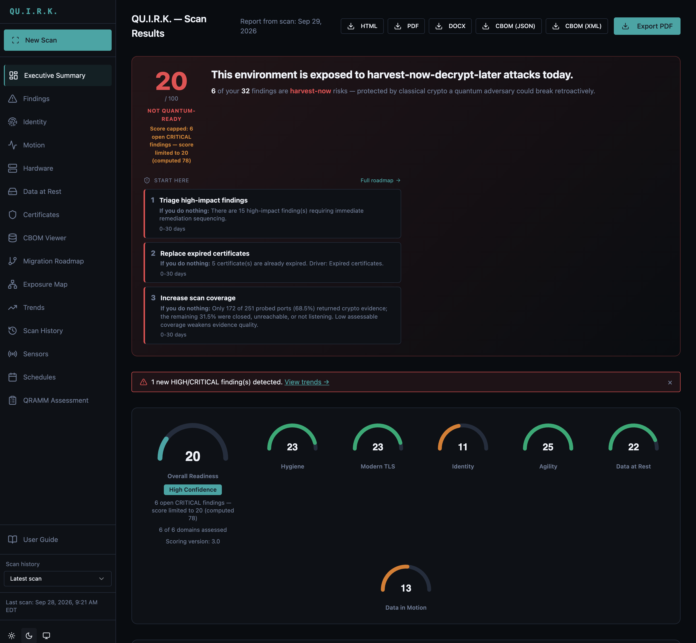

<picture>
<source media="(prefers-color-scheme: dark)" srcset="https://raw.githubusercontent.com/0xD1g5/QU.I.R.K/main/docs/brand/quirk-logo-dark.svg">
<source media="(prefers-color-scheme: light)" srcset="https://raw.githubusercontent.com/0xD1g5/QU.I.R.K/main/docs/brand/quirk-logo.svg">

</picture>

[](https://github.com/0xD1g5/QU.I.R.K/actions/workflows/python-staleness.yml)
[](https://pypi.org/project/quirk-scanner/)
[](LICENSE)
[](docs/release-process.md#attestation-verification)
[](SECURITY.md)

# QU.I.R.K. — v5.25.0

**Quantum Infrastructure Readiness Kit** is a consulting-grade cryptographic inventory and quantum-readiness assessment tool.

QU.I.R.K. is an agentless scanner that finds the cryptography running in an environment: TLS and SSH services, identity infrastructure (SAML, Kerberos, AD CS, JWT/OIDC), mail and message brokers, container images, source code, databases, cloud key management (AWS, Azure, GCP, HashiCorp Vault, Kubernetes), and network and OT/ICS hardware. It produces three things:

- a Cryptography Bill of Materials (CBOM) in CycloneDX JSON and XML;
- a 0–100 quantum-readiness score with six subscores;
- a prioritized migration roadmap, in client-ready PDF, DOCX and HTML reports.

> [!IMPORTANT]
> **Only scan systems you own or are explicitly authorized to assess.** QU.I.R.K. actively connects to the targets you give it: TLS handshakes, SSH negotiation, LDAP and Kerberos queries, and optional read-only OT/ICS probes. Get written authorization before scanning anyone else's infrastructure. The CLI and dashboard also enforce an optional trusted-targets allowlist; see the [Operator's Guide](docs/operators-guide.md).


*The executive summary for a scan of the bundled chaos lab, which is deliberately weak. The score is capped at 20 because six CRITICAL findings are open, even though the computed score is 78. It shows the harvest-now-decrypt-later verdict, the first three remediation steps, and the six subscores.*

## For your role

**For the security consultant.** QU.I.R.K. produces the deliverable:
- a CycloneDX CBOM;
- a 0–100 quantum-readiness score with six subscores (Hygiene, Modern TLS, Identity, Agility, Data at Rest, Data in Motion);
- a written executive narrative;
- a prioritized remediation roadmap, in PDF, DOCX and HTML.

Nothing needs to be installed on the client's systems.

**For the IT generalist.** Start with the simple question: *what crypto do we even have running?* QU.I.R.K. walks your environment and names every TLS endpoint, SSH host, certificate, container image and KMS key it can reach, and tells you which ones are quantum-vulnerable. Browse the results in the dashboard before committing to any remediation work.

**For the compliance officer.** Quantum-readiness is on the audit radar: NIST PQC, CNSA 2.0 and the FIPS 140-3 transition. QU.I.R.K. maps its findings to FIPS 140-3 / CMVP, PCI-DSS 4.0.1 and HIPAA, and tracks the US federal PQC transition deadlines (EO 14412). Each mapping is dated and re-verified on a CI-enforced review cadence. The output (CBOM JSON/XML, PDF reports) can be attached to an audit response.

## Quick Start

Install into a virtual environment. This is recommended on every platform and **required** on Debian, Ubuntu, Kali and Parrot (see the note below).

```bash
python3 -m venv .venv && source .venv/bin/activate
pip install 'quirk-scanner[all]'
quirk init                     # writes a starter config.yaml — edit the targets
quirk --config config.yaml     # run the scan
quirk serve                    # open the dashboard at http://localhost:8512
```

> **Use a venv.** Modern Debian-based distros enforce [PEP 668](https://peps.python.org/pep-0668/) and reject a bare `pip install` into the system Python with `error: externally-managed-environment`. Keep the quotes around `'quirk-scanner[all]'`: zsh, the default shell on macOS, Kali and Parrot, otherwise treats `[all]` as a glob and fails with `no matches found`. Full walkthrough: [Installation → Parrot OS / Kali / Debian](docs/installation.md#parrot-os--kali--debian-pep-668).

The dashboard has no login by default and is meant for local use. To require one, run `quirk token generate --config config.yaml`; see [Configuration → dashboard authentication](docs/configuration.md). For a walkthrough of each step, follow the [Getting Started guide](docs/getting-started.md).

## What QU.I.R.K. Scans

**Always on.** Every scan does these against its targets:
- **TLS / HTTPS**: certificate metadata and chain, cipher suites, protocol versions, and PQC-hybrid key exchange detection (X25519MLKEM768; needs a host `openssl` with ML-KEM).
- **SSH**: host key, key exchange, MAC and cipher algorithms (uses the `ssh-audit` binary).
- **Hardware fingerprinting**: vendor, model and CNSA 2.0 remediation tier, from SSH banners and HTTP management pages. Firmware CVEs and end-of-life dates are matched against **built-in offline tables**.

**Opt-in.** Each of these is enabled with a config key or flag:

| Area | What it inspects | Needs |
|---|---|---|
| **JWT / OIDC APIs** | JWKS keys and signing algorithms, following OIDC discovery | `enable_jwt` |
| **OpenAPI specs** | Declared security schemes, plaintext servers, unauthenticated endpoints | `--openapi-spec` |
| **REST crypto fuzzing** | Active probing of an API's crypto posture, including JWT algorithm confusion; asks for interactive confirmation | `--fuzz`, `[api]` extra |
| **SAML / OIDC identity providers** | IdP metadata signing and encryption certificates and algorithms | `enable_saml` |
| **Kerberos** | KDC encryption types, from an unauthenticated AS-REQ | `enable_kerberos`, `[identity]` extra |
| **AD CS** | CA certificates and templates, read over LDAP; flags ESC1–ESC8 misconfigurations (ESC4/5/7/8 reported as coverage gaps) | `enable_adcs` |
| **S/MIME** | S/MIME certificates discovered via LDAP (reads no mail) | `enable_smime` |
| **Code signing** | LDAP code-signing certificates plus EKU classification of captured TLS certificates | `--inventory-code-signing` |
| **DNSSEC** | DNSKEY / DS algorithms | `enable_dnssec` |
| **Email** | TLS / STARTTLS on the SMTP, submission, IMAP and POP3 ports, and flags STARTTLS downgrade risk on SMTP | `enable_email` |
| **Message brokers** | Kafka, RabbitMQ (AMQPS and management API), Redis TLS, Azure Service Bus, AWS SQS | `enable_broker` |
| **Container images** | Crypto libraries found in the image SBOM | `enable_container`, `syft` |
| **Source code** | Cryptographic API usage (Semgrep `p/cryptography`) | `enable_source`, `semgrep` |
| **Databases** | PostgreSQL / MySQL TLS enforcement | `enable_db` |
| **AWS** | ACM, KMS, CloudFront, ELB listeners, RDS and S3 encryption, EKS | `enable_aws` / `enable_s3` |
| **Azure** | Key Vault keys and certificates, Application Gateway TLS policy, Blob encryption | `enable_azure` / `enable_blob` |
| **GCP** | Cloud KMS (including PQC algorithms), Cloud SQL TLS, GCS encryption | `enable_gcp` |
| **HashiCorp Vault** | Transit key types (including ML-DSA / SLH-DSA), PKI mounts, auth methods | `enable_vault` |
| **Kubernetes** | EKS / GKE / AKS secrets-encryption configuration; lists secret types but never reads secret data | `enable_k8s` |
| **SNMP** | Device identity via SNMP v2c / v3 (auth + priv) | `--enable-snmp`, `[hw]` extra |
| **Modbus/TCP** | One read-only device-identification request | `--enable-modbus`, `[hw]` extra |
| **BACnet/IP** | Who-Is, then model name and firmware revision | `--enable-bacnet`, `[hw]` extra |

`[all]` covers the cloud, database, broker, email, AD CS, report and dashboard dependencies. It deliberately leaves out **`[hw]`** (SNMP, Modbus, BACnet), **`[api]`** (REST fuzzing) and **`[identity]`** (Kerberos). Install those explicitly, e.g. `pip install 'quirk-scanner[all,hw]'`. The [Configuration Reference](docs/configuration.md) documents every key.

## Output

- **Quantum-readiness score** (0–100) with six subscores: Hygiene, Modern TLS, Identity, Agility, Data at Rest, Data in Motion. The score is capped while CRITICAL findings remain open, and it never reaches 100 without post-quantum cryptography in place.
- **CBOM** in CycloneDX JSON and XML. Hardware is modelled as DEVICE components with FIRMWARE children.
- **Reports** in PDF, DOCX and HTML, plus CLI markdown, all rendered from one shared content model, with a written executive narrative and a NOW / NEXT / LATER migration roadmap.
- **Web dashboard** (`quirk serve`) with these views: executive summary, findings with a per-finding storyline, identity, data in motion, data at rest, certificates, hardware inventory, CBOM viewer, migration roadmap, quantum exposure map (key reuse across endpoints), trends, scan history, schedules, sensors and QRAMM assessment. Light and dark themes are included.
- **Distributed mode**: on-prem sensors scan isolated network segments and push findings to a central console, which merges them into one CBOM and score. A Windows sensor build ships as a GitHub Release asset.
- **Integrations**: notifications, SIEM CEF export, and Jira / ServiceNow ticket creation.

Sample CBOMs live in [`examples/cbom/`](examples/cbom/), one per major scan profile.

## Documentation

| Guide | Description |
|-------|-------------|
| [Getting Started](docs/getting-started.md) | Zero to first scan in under 10 minutes |
| [Installation](docs/installation.md) | System requirements for macOS, Linux and Windows WSL |
| [Configuration Reference](docs/configuration.md) | Every config.yaml option and CLI flag |
| [Operator's Guide](docs/operators-guide.md) | Running engagements: scope, allowlists, scheduling, sensors |
| [Connector Guides](docs/connectors/) | AWS, Azure, Docker and Git setup with credential templates |
| [Cloud Console Deployment](docs/deployment-cloud-console.md) | Running the console on a cloud VM with internal sensors pushing to it |
| [Report Interpretation](docs/report-interpretation.md) | What every score and finding means, plus a client conversation guide |
| [CBOM Guide](docs/cbom-guide.md) | What a CBOM is and how to cite it as compliance evidence |
| [Chaos Lab Guide](docs/chaos-lab.md) | A Docker lab of **deliberately weak** crypto services to scan. Run it on an isolated host only, and never expose it to a network |
| [Intelligence Schema](docs/intelligence-schema.md) | The `intelligence-*.json` output format |
| [Upgrade Guide](docs/upgrade-guide.md) | Cross-version upgrades with `quirk db migrate` |
| [Release Process](docs/release-process.md) | Publishing, and Sigstore attestation verification |

## What's New in v5.25

The scoring model changed in v5.25 (`SCORING_VERSION` 3.0). v5.25 scores are **not comparable** with scores from earlier releases.

- **Every surface reports the same score.** The dashboard, the PDF report and the CLI now agree exactly on the headline score, the CRITICAL count and the certificate count for a given scan. A single certificate no longer produces two findings.
- **A more honest score.** An absolute consequence ceiling caps the score while CRITICAL findings are open. No environment scores 100 without post-quantum cryptography. Every ratio penalty now divides by the population it describes; for example, certificate ratios divide by the certificate count, not the probe count.
- **Dashboard fixes**, including chronological date sorting and theme-correct colours: 205 hard-coded colours were replaced with theme tokens across 17 files.

v5.25.0 also includes the untagged v5.22–v5.24 work: consulting-report branding and templates, a score-lift migration roadmap, the finding storyline drawer, the Quantum Exposure Map, and an Executive Verdict layer. The full per-release history is in [CHANGELOG.md](CHANGELOG.md).

## Install

- **PyPI:** `pip install 'quirk-scanner[all]'` (see Quick Start). Releases are published through PyPI Trusted Publishers with Sigstore attestations; verify them with `gh attestation verify`, as described in [Release Process](docs/release-process.md#attestation-verification).
- **Windows sensor:** a frozen `quirk.exe` zip and a Scheduled Task installer are attached to each [GitHub Release](https://github.com/0xD1g5/QU.I.R.K/releases).
- **Homebrew and a GHCR container image** are planned but **not published yet**. Use PyPI for now.

> **No `curl | bash` installer.** This is deliberate. Piping HTTP into a shell bypasses the integrity guarantees of Sigstore attestations and Trusted Publishers. See [`docs/release-process.md`](docs/release-process.md).

<details>
<summary>Develop from source</summary>

```bash
git clone https://github.com/0xD1g5/QU.I.R.K
cd QU.I.R.K
python -m venv .venv && source .venv/bin/activate
pip install -e '.[dashboard]'
playwright install chromium
quirk --help
```

The editable install is for contributors. End users should install from PyPI.

</details>

## License

MIT. See [LICENSE](LICENSE).
