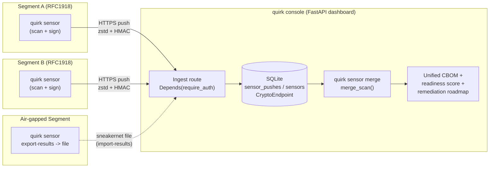
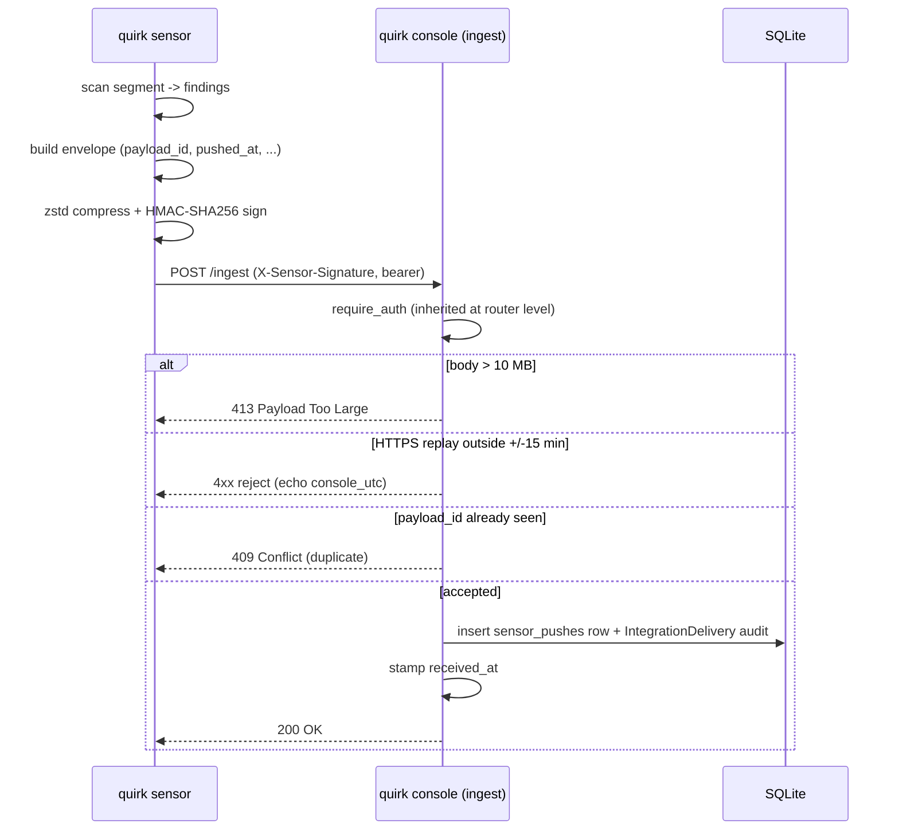

# QU.I.R.K. v5.4 — Distributed On-Prem Scanner Architecture

> **Canonical contract.** This document is the single source of truth for the v5.4
> distributed sensor/console architecture. Every downstream phase (107 data-model →
> 108 sensor/WinCI → 109 ingestion → 110 merge → 111 dashboard → 112 chaos-lab/stab)
> cites this doc — by section — as its design contract.
>
> **This phase ships ZERO runtime code.** No schema migrations, no CLI changes, no
> Python files. The entire deliverable is this Markdown document. It LOCKS the
> decisions that would be expensive to change mid-milestone, derived verbatim from
> `106-CONTEXT.md` (decisions D-01..D-15). Where CONTEXT.md and earlier research
> disagree, CONTEXT.md wins.

---

## 1. Overview & design invariants

QU.I.R.K. v5.4 splits the scanner into two cooperating **roles within one package**:

- **Sensor** — runs segment-local scans (TLS, SSH, JWT/API, container, source, KMS),
  signs the results, and pushes them to a console. A sensor may also spool results to a
  file for air-gapped transit.
- **Console** — the existing FastAPI dashboard, extended with an ingest route. It
  authenticates pushes, stores raw payloads, merges the union of all sensor findings,
  and produces the unified CBOM, quantum-readiness score, and remediation roadmap.

### Design invariants (non-negotiable for v5.4)

1. **Sensor/console split, single package.** There is **no package split**. `quirk sensor`
   and `quirk console` are new mode flags dispatched via the same subcommand-intercept
   pattern already used by `serve`, `schedule`, `token`, `export`, and `ticket` in
   `run_scan.py` (subcommand dispatch begins at the `serve` intercept ~L381; `quirk sensor`
   / `quirk console` intercept identically, before scan argparse).
2. **Single-tenant only.** No `tenant_id`, no multi-tenancy. One console serves one
   engagement at a time. (See §9.)
3. **Additive schema only.** No destructive migrations, no Alembic. New columns/tables go
   through the existing `_ensure_columns` helper (`quirk/db.py`, `_ensure_columns` ~L127)
   registered in `_ADDITIVE_MIGRATIONS` (~L172).
4. **NULL `sensor_id` = implicit local sensor.** Existing single-host scans keep working
   unchanged; a row with no `sensor_id` is treated as the local sensor (D-03). Full
   backward compatibility.
5. **OS-agnostic wire contract.** The sensor→console payload carries no OS-specific
   assumptions. The contract is identical for Linux, macOS, and Windows sensors (see §10).
6. **Reuse v5.3 security primitives.** Auth (`require_auth`), timing-safe comparison
   (`hmac.compare_digest`), SSRF allowlist (`validate_external_url`), and exception
   scrubbing (`safe_str()`) are reused — not reinvented.

---

## 2. Topology diagram (Mermaid)



The diagram renders in GitHub and Obsidian. N segment-local sensors push over HTTPS (or
spool to file for air-gapped segments) → console FastAPI ingest → SQLite → manual merge →
unified CBOM/score.

---

## 3. Wire Contract

The sensor→console push carries a single signed, compressed JSON envelope. The console
ingest route, the air-gap `import-results` path, and the Phase 107 `sensor_pushes` table
all consume the **same** schema.

### 3.1 Envelope field table

| Field | Type | Required | Description |
|-------|------|----------|-------------|
| `payload_id` | UUID (string) | yes | Unique per push. Console dedups on this → duplicate yields **HTTP 409** (D-07). |
| `pushed_at` | ISO-8601 UTC datetime | yes | Sensor clock at push time. Compared to `received_at` for the ±15-min replay window (HTTPS only, D-08). |
| `received_at` | ISO-8601 UTC datetime | server-set | Console clock at ingest. Sensors send `pushed_at`; the console stamps `received_at`. |
| `schema_version` | string (semver) | yes | Wire-contract version. Skew is **warn-only**, never blocks ingest (D-11). |
| `sensor_version` | string | yes | QU.I.R.K. version of the sensor. Drives the non-blocking skew warning (D-11). |
| `sensor_id` | UUID (string) | yes | Identifies the originating sensor (matches the `sensors` manifest, §6). |
| `segment` | string | yes | Operator label for the network segment (e.g. `dmz`, `prod-east`). |
| `findings` | array of endpoint objects | yes | The scanned `CryptoEndpoint` findings (host, port, protocol, cert/pubkey fields, scanned_at, etc.). |

### 3.2 JSON example

```json
{
  "payload_id": "f1a3c0de-4b2e-4d1a-9f3c-7a2b1c0d9e8f",
  "pushed_at": "2026-05-25T16:30:00Z",
  "schema_version": "1.0.0",
  "sensor_version": "5.4.0",
  "sensor_id": "9c2b1a00-1111-2222-3333-444455556666",
  "segment": "prod-east",
  "findings": [
    {
      "host": "10.20.0.15",
      "port": 443,
      "protocol": "TLS1.2",
      "cert_pubkey_alg": "RSA",
      "cert_pubkey_size": 2048,
      "scanned_at": "2026-05-25T16:28:41Z"
    }
  ]
}
```

`received_at` is **not** sent by the sensor — the console assigns it on ingest. It appears
in the stored `sensor_pushes` row and in rejection diagnostics.

### 3.3 Transport

- **HTTPS** to the console ingest route.
- **zstandard level-3** compression (already in the codebase) over the JSON body.
- **httpx** client (already in the codebase; reused — no new HTTP dependency).
- **Application-layer integrity header:** `X-Sensor-Signature: hmac-sha256=<hex>`.
  The HMAC-SHA256 is computed over the request body with a per-sensor key derived from the
  enrollment token. There is **NO mTLS / PKI** in v5.4 (D-04, §9) — integrity and sender
  authenticity ride on the HMAC signature plus the bearer auth of §6.

### 3.4 Air-gap carve-out (D-15)

`quirk sensor export-results` writes the **IDENTICAL** payload — same `payload_id`, same
`schema_version`, same `pushed_at`, same `findings`, same HMAC signature, same zstd
compression — to a file instead of pushing it over HTTPS. `quirk console import-results`
reads that file and runs it through the **same ingest + dedup path**. Export is
"push-to-file": one schema, one merge path. The only behavioral difference is the
transport-conditional replay rule (§6): the ±15-min window applies to HTTPS push only;
air-gap import skips the time-window check but **keeps `payload_id` dedup**.

---

## 4. Push sequence diagram (Mermaid)



The sequence shows the gate order — auth → body-size (413) → replay window (4xx with
`console_utc`) → dedup (409) → accept (200 + audit row).

---

## 5. Data-model keying

### Uniqueness key: `(sensor_id, host, port)`

The endpoint uniqueness key becomes **`(sensor_id, host, port)`** (D-03). This is the
critical fix for the **same-IP collision** pitfall: two different segments can legitimately
both contain `10.0.0.5:443` (RFC1918 ranges repeat across segments). Keying on
`(sensor_id, host, port)` keeps them as two distinct endpoints instead of collapsing them.

### Additive columns on `CryptoEndpoint`

`CryptoEndpoint` (`quirk/models.py`, `class CryptoEndpoint` at L9) gains two **nullable**
columns via the existing additive-migration path (`_ensure_columns` + `_ADDITIVE_MIGRATIONS`
in `quirk/db.py`; no Alembic):

| Column | Type | Nullable | Indexed | Notes |
|--------|------|----------|---------|-------|
| `sensor_id` | String | yes | yes | Originating sensor. **NULL = implicit local sensor** (backward-compatible). |
| `segment` | String | yes | no | Operator segment label, carried for context/reporting. |

A **NULL `sensor_id`** denotes the implicit local sensor — every pre-v5.4 scan row remains
valid and is treated as local. No existing data is rewritten.

### CBOM component identity must include `sensor_id`

`build_cbom` (`quirk/cbom/builder.py`, `def build_cbom` at L445) builds components in a
three-pass walk; Pass-1 dedups algorithms into `algo_registry` (~L461). The **component
identity hash MUST incorporate `sensor_id`** so the same RFC1918 `host:port` discovered in
two segments produces **two distinct components**, not one merged component. Without this,
the merge would silently collapse cross-segment duplicates and undercount the inventory.

---

## 6. Enrollment & auth model

### One-time-use enrollment tokens (D-02)

Sensor enrollment mirrors the existing `token_cmd.py` pattern (`secrets.token_urlsafe(32)`
at L100):

- The console mints a raw token with `secrets.token_urlsafe(32)`.
- Only the **SHA-256 hash** is stored, in a new `sensor_tokens` table. The **raw token is
  never persisted**.
- The token is **one-time-use** — consumed at enrollment, then marked spent. It is **NOT**
  time-windowed.
- On enrollment, the sensor receives its `sensor_id` and the per-sensor key material used
  to derive the `X-Sensor-Signature` HMAC.

### Enrollment manifest field set (D-13) — feeds the Phase 107 `sensors` table

| Field | Type | Nullable | Notes |
|-------|------|----------|-------|
| `sensor_id` | UUID | no (PK) | Primary key. |
| `segment` | String | no | Network segment label. |
| `engagement` | String | yes | Consulting/client context, in-scope for v5.4. |
| `enrolled_at` | datetime | no | Enrollment time. |
| `last_push_at` | datetime | yes | Updated on each accepted push; drives overdue detection (§7). |
| `expected_cadence_minutes` | int | no | Default **1440** (24h); operator-overridable. |
| `sensor_version` | String | yes | Drives the non-blocking version-skew warning. |

### Auth — inherited `require_auth` (anti-bypass)

The ingest route inherits auth at the **router** level, not per-handler:
`APIRouter(dependencies=[Depends(require_auth)])`. This is the anti-bypass rule — declaring
auth on the router means **every** route under it is protected, so a future handler added to
the router cannot accidentally ship unauthenticated. This reuses
`quirk/dashboard/api/middleware/auth.py` (`def require_auth` at L34), which compares
credentials timing-safely with `hmac.compare_digest` (the empty-string guard + compare at
L54/L61).

### Ingest dedup & replay policy

- **`payload_id` dedup → HTTP 409 (D-07).** A previously-seen `payload_id` is rejected as a
  duplicate.
- **Replay window ±15 min (D-08).** For HTTPS push, `pushed_at` must be within ±15 minutes
  of `received_at`. Outside the window → reject, echoing `console_utc` in the response so the
  operator can diagnose clock skew. Stated as **±15 min** / 15-min window.
- **Transport-conditional carve-out (D-15).** The ±15-min replay window applies to **HTTPS
  push only**. Air-gap `import-results` **SKIPS** the time-window check (sneakernet transit
  may take days) but **KEEPS `payload_id` dedup → 409**. Replay-window is
  transport-conditional, NOT payload-conditional.
- **Body-size limit 10 MB → HTTP 413 (D-09).** FastAPI has no default body-size limit; the
  ingest route enforces a 10 MB cap and returns 413 above it.
- **Retention (D-10).** Accepted `payload_id`s are retained **indefinitely — no TTL / cleanup
  job in v5.4**. Single-tenant on-prem volume is low; revisit in v5.5 only if a deployment
  grows unbounded.
- **Version-skew (D-11) — warn-only.** The Pydantic ingest model uses **`extra='ignore'`**
  (unknown fields dropped for forward-compat). A `schema_version` / `sensor_version` mismatch
  **never blocks ingest** — it surfaces a non-blocking version-skew warning on the sensor
  registry/heartbeat page. This keeps air-gapped or lagging sensors working.
- **Exception scrubbing.** All exception stringification in the ingest path uses `safe_str()`
  (downstream Phase 109) so push errors never leak internal state into audit rows or
  responses.

A per-push `IntegrationDelivery` audit row (`quirk/models.py`, `class IntegrationDelivery`
at L245) is written on accept, reusing the existing audit pattern.

---

## 7. Merge pipeline

### Manual trigger in v5.4 (D-06)

Merge is **operator-invoked** via `quirk sensor merge` (CLI command / console button). The
merge function is built as a **standalone callable, `merge_scan()`**, so a v5.5 automatic
"poll-on-full-check-in" trigger can call it **without refactoring**. No poller or scheduler
state is built in v5.4 — this doc records the seam only.

### Option A unified scoring (D-01)

Merge re-runs the **UNION of all sensor findings** through the **unchanged** engine chain:

```
build_evidence_summary  ->  compute_readiness_score  ->  build_cbom
```

(`compute_readiness_score` at `quirk/intelligence/scoring.py` L119; the six-subscore `/ 1.5`
rollup at ~L290.)

**NEVER average pre-scored sub-results.** Averaging segment scores is mathematically wrong:
the ratio penalties in `compute_readiness_score` use full-population denominators, so a
per-segment score cannot be linearly combined. The correct approach is to pool every
endpoint and score once. A **`per_segment_scores`** breakdown is added **for context only**,
never as a scoring input.

### Coverage-warning & staleness thresholds (D-14)

- Default `expected_cadence_minutes` = **1440** (24h), operator-overridable per sensor.
- A sensor is **overdue** when `now > last_push_at + 2× cadence`.
- Merge emits a **`coverage_warning`** listing overdue `sensor_id`s (or **null** when all
  sensors are current).
- **Partial coverage is scored but ALWAYS flagged** — never silently merged as complete.
- Scan results are flagged **stale after 30 days**.
- All thresholds are operator-overridable.
- **Sensor-local `scanned_at` timestamps are preserved**, never rewritten during merge.

---
