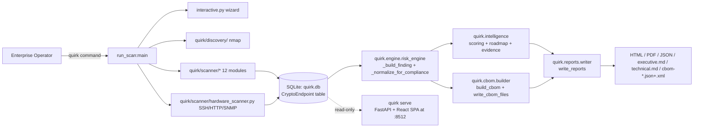
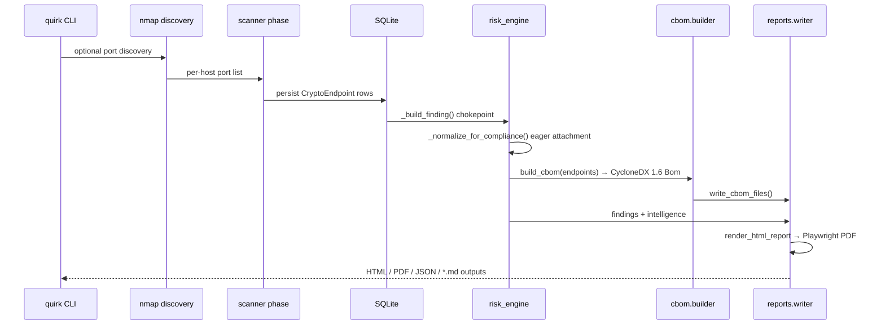
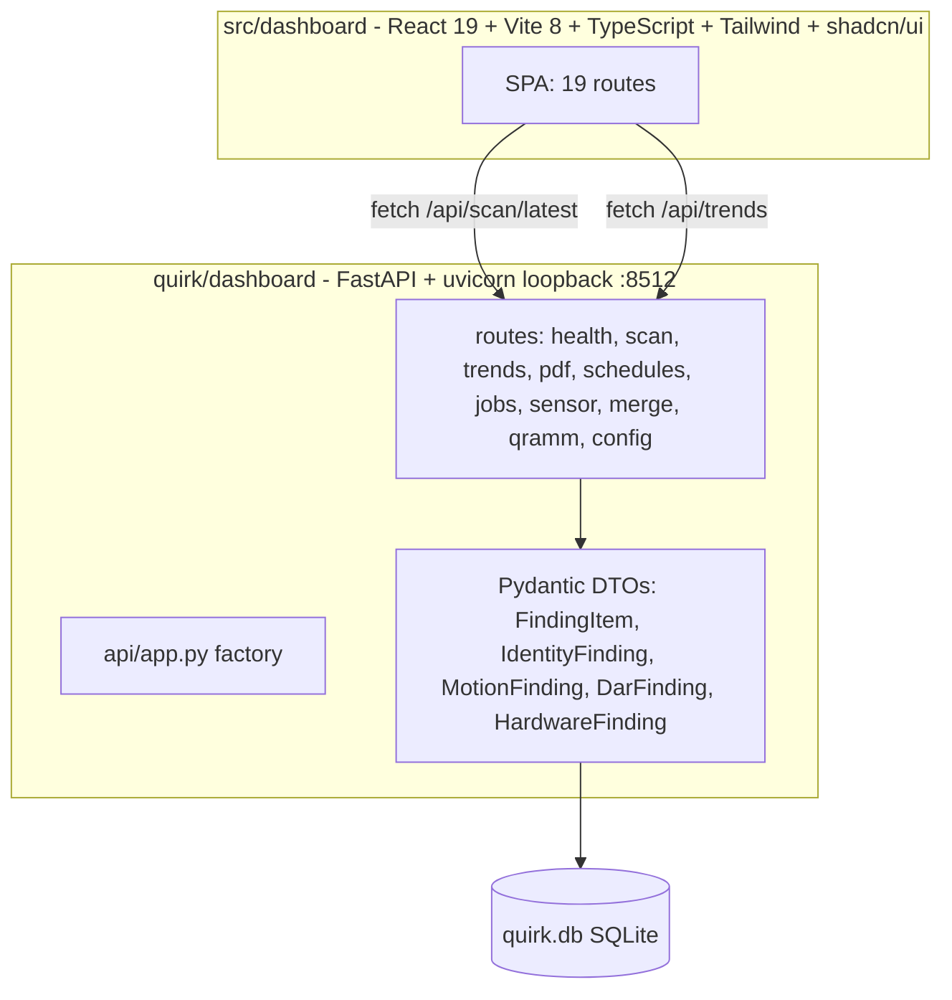

# QU.I.R.K. — Architecture Reference

*(Audience: enterprise architects, security reviewers, and consultants evaluating QU.I.R.K. before deployment. This document is a runtime-and-trust-model reference, not a contributor code tour. It assumes no prior reading of the codebase.)*

---

## 1. System Overview

QU.I.R.K. (Quantum Infrastructure Readiness Kit) is a **single-host Python CLI** that runs as a privileged operator from a workstation or jump host, performs cryptographic posture scans against operator-supplied targets, persists findings to a local SQLite database, and emits CycloneDX CBOM plus HTML / PDF / JSON / Markdown reports. An optional FastAPI dashboard (`quirk serve`) renders the same SQLite database read-only at `127.0.0.1:8512`.

QUIRK is **outbound-only at scan time** (it reaches scan targets and optionally a chaos lab) and **loopback-only when serving the dashboard**. There is no telemetry, no phone-home, no cloud component. All artifacts — database, reports, CBOM — live in the operator's working directory.

The CLI entry point is registered via `pyproject.toml` `[project.scripts]` as `quirk = run_scan:main`. `run_scan.py:main` (line 176) is the argparse entry; subcommand routing for `compliance` and `serve` is handled inside `main()` (see §9).

---

## 2. Trust Boundaries and Network Surface

QUIRK runs as the operator's identity on the operator's workstation. It crosses three trust boundaries:

1. **Operator → scan target.** Outbound TLS, SSH, SMTP, AMQP, LDAP, DNS, HTTP, etc. directed at the operator-supplied target list. QUIRK does not pivot, does not exploit, does not hold connections open beyond the protocol probe budget defined in [`docs/timeout-retry-audit.md`](timeout-retry-audit.md).
2. **Operator → cloud control plane (optional).** AWS / Azure / GCP / Vault / Kubernetes connectors call cloud APIs over TLS using the operator's existing identity (see credential matrix below). QUIRK never creates, modifies, or destroys cloud resources — read-only describe / list / get only.
3. **Dashboard → operator browser.** `quirk serve` binds `127.0.0.1:8512` (loopback) and serves a single-page application backed by FastAPI. There is no auth layer because there is no remote attack surface — the bind address is loopback by design and is not configurable to a routable interface in the shipped configuration.

QUIRK has **no inbound surface** outside of `quirk serve` and **no outbound telemetry** of any kind. There is no automatic updater. There is no cloud sync. The database, reports, and CBOM never leave the working directory unless the operator copies them.

### Connector Credential Storage Matrix

QUIRK reads credentials at scan time from sources outside the QUIRK process and **never persists any credential value to `quirk.db` or any output artifact**. Findings reference connector identity (e.g., AWS account ID, Vault namespace, kube-context) but never the secret material that authorized the call.

| Connector | Credential Source | Where Stored | QUIRK Persists Credential? |
|-----------|-------------------|--------------|----------------------------|
| AWS | `~/.aws/credentials` profile (boto3 default chain; configurable via `connectors.aws_profile`) | Filesystem outside QUIRK | No |
| Azure | `DefaultAzureCredential` chain (env vars, managed identity, `az` CLI cache, etc.) | OS / cloud identity provider | No |
| GCP | Application Default Credentials (ADC) | OS / metadata server | No |
| Vault | `VAULT_TOKEN` env var (or `connectors.vault_token` config) | Env or config file | No (read once per run) |
| Kerberos | Host krb5 ticket cache (`KRB5CCNAME`) with impacket password fallback | OS keyring / `FILE:` cache | No |
| Database (Postgres / MySQL) | `connectors.pg_scanner_password` / `mysql_scanner_password` in `config.yaml` | Plaintext in config file ⚠ | No (rotate per engagement; least-privilege read-only DB user recommended) |
| Kubernetes | kubeconfig (default `~/.kube/config`, override `connectors.k8s_kubeconfig`) | Filesystem outside QUIRK | No |
| Docker (image SBOM) | Local docker socket / pulled image (no credentials unless registry auth) | OS | No |
| Git (semgrep source scan) | Local clone path; auth provided by the operator's `git` config | OS | No |

The database connector row is the only credential source that lands plaintext in a QUIRK-owned config file. Operators should treat `config.yaml` as a secret artifact for the engagement and pair it with a least-privilege, read-only scanner database account.

---

## 3. Scanner Phase Model

Every scanner runs inside `_phase_timer(run_stats, name)` (run_scan.py:82) and is wrapped by `_wrapped_phase(...)` (run_scan.py:93). The wrapper is the firewall: a `BaseException` raised inside one scanner cannot crash the run, and missing-extra advisories (e.g., `pip install quirk-scanner[cloud]` not installed) surface as findings rather than tracebacks. This is what lets QUIRK ship a single CLI that can be partially installed and still produce a coherent report.

The 12 scanner modules and 1 discovery package are:

| Phase Wrapper Site | Module | Purpose |
|--------------------|--------|---------|
| run_scan.py:388 | `quirk/discovery/nmap_provider.py`, `nmap_parser.py`, `coverage.py` | Optional nmap port discovery + multi-target wizard |
| run_scan.py:462 | `quirk/scanner/fingerprint.py` + `target_expander.py` | Pre-scan target enumeration / fingerprinting |
| run_scan.py:546 | `quirk/scanner/tls_scanner.py` | TLS protocol + cipher + cert inventory |
| run_scan.py:584 | `quirk/scanner/ssh_scanner.py` | SSH kex / hostkey / cipher inventory |
| run_scan.py:593+ | `quirk/scanner/jwt_scanner.py` | JWT / API token algorithm inventory |
| run_scan.py:593+ | `quirk/scanner/container_scanner.py` | Container image SBOM (docker / oci) |
| run_scan.py:593+ | `quirk/scanner/source_scanner.py` | semgrep-driven source-code crypto detection |
| run_scan.py:593+ | `quirk/scanner/dnssec_scanner.py` | DNSSEC algorithm chain inspection |
| run_scan.py:593+ | `quirk/scanner/kerberos_scanner.py` | KDC enctype / SPN inventory |
| run_scan.py:593+ | `quirk/scanner/saml_scanner.py` | SAML IdP signature / encryption inventory |
| run_scan.py:593+ | `quirk/scanner/email_scanner.py` | SMTP / IMAP / POP3 STARTTLS inventory |
| run_scan.py:593+ | `quirk/scanner/broker_scanner.py` | AMQP / MQTT / Kafka broker TLS inventory |
| run_scan.py:937 | `quirk/scanner/{aws,azure,gcp}_connector.py`, `db_connector.py`, `k8s_connector.py`, `vault_connector.py` | Cloud KMS + database + cluster + secrets vault posture |
| run_scan.py:989 | `quirk/engine/risk_engine.py` | Finding synthesis (terminal phase) |

See [`docs/timeout-retry-audit.md`](timeout-retry-audit.md) for the per-phase `TimeoutsCfg` + `RetryCfg` policy table.

---

## 4. Data Flow: Scan → DB → CBOM → Reports

Within a single `quirk` invocation, data moves through five well-defined transitions: **discovery → scanner persistence → risk synthesis → CBOM build → report rendering**. Each transition has exactly one chokepoint, which is why the data flow is auditable end-to-end.

Compliance attachment is **eager** at `_build_finding()` (Phase 49 D-02) — every emitted finding carries its `compliance:` field as soon as it leaves the risk engine; HTML / PDF renderers read what is already there rather than joining late. This is the single most important invariant in the data flow: a finding is born compliance-aware.

See also: [`docs/cbom-guide.md`](cbom-guide.md), [`docs/intelligence-schema.md`](intelligence-schema.md).

---

## 5. SQLite Schema

QUIRK persists scanner output to a single local SQLite file (default `quirk.db`). The schema is one declarative table.

- **Models module:** `quirk/models.py` defines a single `declarative_base()` and one ORM class, `class CryptoEndpoint` (table name: `crypto_endpoints`). Every scanner — TLS, SSH, JWT, container, source, DNSSEC, Kerberos, SAML, email, broker, plus all cloud / DB / k8s / Vault connectors — writes to this table.
- **Migrations:** `quirk/db.py` uses a generic `_ensure_columns(engine, table, columns)` helper, invoked from both `init_db()` and the public `run_additive_migration()` orchestrator. Column migrations are **additive only** — never drop, never rename — which keeps an older database file readable by a newer QUIRK without an offline migration step. Separate table-level `_ensure_*_table(s)` helpers create new tables on first boot: `_ensure_qramm_tables`, `_ensure_scheduled_tables`, `_ensure_scan_jobs_table`, `_ensure_scan_checkpoints_table`, `_ensure_integration_deliveries_table`, `_ensure_merge_runs_table`.
- **Per-scanner large payloads:** Scanners that produce nested per-host structures (kerberos, saml, email, broker, dnssec, vault, db, k8s) serialize to `*_scan_json` Text columns keyed by the lowest-port endpoint per host, so a single host yields exactly one row per scanner regardless of how many ports were probed.

The result is a database that survives version upgrades in place and that can be opened by any SQLite client for ad-hoc post-scan analysis.

---

## 6. Dashboard Architecture

The dashboard is a two-tier read-only viewer over `quirk.db`.

- **Frontend.** `src/dashboard/` is a Vite 8 + React 19 + TypeScript + Tailwind + shadcn/ui SPA with 19 routes: `/` (executive), `/findings`, `/identity`, `/motion`, `/hardware`, `/data-at-rest`, `/certificates`, `/cbom`, `/roadmap`, `/trends`, `/print`, `/qramm`, `/qramm/assessment`, `/schedules`, `/scan/new`, `/scan/job/:jobId`, `/scans`, `/sensors`, `/compare`. A conditional vertical-specific route is also registered at runtime when the active vertical provides a page component. The built bundle is **committed under `quirk/dashboard/static/`** so `quirk serve` ships the UI without requiring a node toolchain on the target host — air-gap friendly.
- **Backend.** `quirk/dashboard/server.py` exposes `quirk serve` via `run_scan.py:220`. `quirk/dashboard/api/app.py` is the FastAPI factory; routes live in ten modules (`health.py`, `scan.py`, `trends.py`, `pdf.py`, `schedules.py`, `jobs.py`, `sensor.py`, `merge.py`, `qramm.py`, `config.py`). DTOs (`FindingItem`, `IdentityFinding`, `MotionFinding`, `DarFinding`, `HardwareFinding`, etc.) are Pydantic models that shape the SQLite rows for SPA consumption.
- **Persistence.** The dashboard opens `quirk.db` read-only. Mutations only happen during `quirk` scan runs.
- **Bind address.** uvicorn defaults to `127.0.0.1:8512`. Loopback is the security boundary.

---

## 7. CBOM Pipeline

QUIRK produces a CycloneDX 1.6 CBOM as a first-class output, not an afterthought.

- **Build.** `quirk/cbom/builder.py::build_cbom(endpoints) -> Bom` consumes the same `CryptoEndpoint` rows that feed the risk engine, classifies each algorithm reference via `quirk/cbom/classifier.py`, and emits a CycloneDX 1.6 `Bom` object.
- **Write.** `quirk/cbom/writer.py::write_cbom_files()` serializes that `Bom` to `cbom-<ts>.json` and `cbom-<ts>.xml` in the report output directory.
- **Coverage report.** Algorithm coverage is regenerable via `tests/test_cbom_classifier_coverage.py::test_regenerate_coverage_report`, producing `docs/cbom-classifier-coverage.md`.

When PQC is referenced in CBOM output, QUIRK uses the **FIPS-finalized algorithm names**: FIPS 203 (ML-KEM), FIPS 204 (ML-DSA), FIPS 205 (SLH-DSA). Pre-standardization names are not emitted.

See also: [`docs/cbom-guide.md`](cbom-guide.md), [`docs/cbom-classifier-coverage.md`](cbom-classifier-coverage.md).

---

## 8. Reports Pipeline

Reports are rendered through a single orchestrator and a single Jinja template.

- **Orchestrator.** `quirk/reports/writer.py::write_reports()` is the only entry point that builds report artifacts. It owns the output directory layout and timestamps.
- **Template.** `quirk/reports/templates/report.html.j2` is the single Jinja template shared by HTML and PDF outputs. PDF is rendered by Playwright headless Chromium against the same HTML — there is no second template to drift.
- **Markdown outputs.** `executive.md` and `technical.md` render alongside HTML / PDF for paste-into-Confluence / paste-into-Jira workflows.
- **Versioned constants.** `quirk/reports/writer.py` imports `PLATFORM_VERSION` dynamically from the package (`from quirk import __version__ as PLATFORM_VERSION`) so it always reflects the installed package version. `SCHEMA_VERSION = 2` is a hardcoded integer bumped only on incompatible structural changes. Reports embed these so consumers can detect schema-incompatible changes without parsing the body.

---

## 9. Subcommand Routing (CLI)

`quirk init`, `quirk serve`, and `quirk compliance status` all reach `run_scan:main`. Routing for `compliance` and `serve` is handled **inside** `main()` rather than as registered argparse subparsers — `compliance` is dispatched by an argv sniff at `run_scan.py:223–244`, and `serve` is dispatched at `run_scan.py:220` to `quirk.dashboard.server.serve`. This is intentional: it keeps a single argparse surface for scan options and avoids a subparser tree that would force scan flags onto the auxiliary commands.

The practical implication for operators: every `quirk <subcommand>` invocation goes through the same entry function, so logging / config-loading behavior is consistent across the CLI.

---

## 10. Versioning and Versioned Constants

QUIRK keeps three versioned constants in `quirk/reports/writer.py`:

- `PLATFORM_VERSION` — dynamically imported from the package (`from quirk import __version__ as PLATFORM_VERSION`); resolves to the installed package version at runtime (e.g., `5.8.0`).
- `SCHEMA_VERSION = 2` — report JSON schema. Bumped on incompatible structural changes.
- `INTELLIGENCE_VERSION` — assigned from `PLATFORM_VERSION` so it tracks the platform version automatically.

---

## 11. References

- [`docs/quirk-overview.md`](quirk-overview.md) — high-level pitch and product framing.
- [`docs/cbom-guide.md`](cbom-guide.md) — CBOM citation language and consumer guidance.
- [`docs/cbom-classifier-coverage.md`](cbom-classifier-coverage.md) — algorithm coverage report.
- [`docs/intelligence-schema.md`](intelligence-schema.md) — finding / scoring schema.
- [`docs/timeout-retry-audit.md`](timeout-retry-audit.md) — per-phase timeout / retry policy.
- [`docs/operators-guide.md`](operators-guide.md) — install, configure, scan, troubleshoot, per-scanner reference.

---

## 12. Hardware Scanning

QU.I.R.K. identifies network infrastructure devices — routers, firewalls, load balancers, HSMs, and management controllers — using a three-signal cascade, each requiring progressively more network access. Hardware scanning is a parallel signal path to the cryptographic protocol scanners; its findings are stored in the same SQLite database and emitted in the same CBOM output, but through dedicated modules in `quirk/scanner/` (`hardware_scanner.py`, `hardware_meta.py`, `hardware_tier.py`) that require the optional `[hw]` extras (`pip install 'quirk-scanner[hw]'`).

### Signal Chain

The scanner attempts identification in order, stopping at the first successful match:

1. **SSH banner** — SSH server version strings (e.g., `SSH-2.0-Cisco-1.25`) are matched against a curated vendor/model pattern table. Requires only TCP/22 access; no credentials needed.
2. **HTTP management interface** — HTTP responses from well-known management ports are fingerprinted against vendor header and title patterns. Requires TCP access to management ports; no credentials needed.
3. **SNMP probe** — Three OIDs are retrieved via SNMPv2c: `sysDescr` (full device description string), `sysName` (configured hostname), and `sysObjectID` (enterprise OID tree). The response is parsed first by the `sysdescrparser` library and then by a vendor regex fallback when library parsing yields no match. Requires UDP/161 access and a read-only community string (configured via the `snmp_community` key in `config.yaml`). The read-only community string is the trust-boundary contract: QUIRK never issues SNMP write or inform operations.

Each matched device receives a confidence grade (`high`, `medium`, `low`, or `unknown`) based on which signal produced the match. SSH banner matches are graded `high`; SNMP-only matches are graded `medium` or `low` depending on the specificity of the sysObjectID match.

### CNSA 2.0 Remediation Tiers

Every identified device is classified into a CNSA 2.0 remediation tier that reflects its quantum-readiness migration path:

- **Tier 1** — PQC-capable hardware with an active CNSA 2.0 migration path already available.
- **Tier 2** — Hardware that can be upgraded to PQC via firmware or configuration change without hardware replacement.
- **Tier 3** — End-of-life hardware requiring physical replacement before CNSA 2.0 deadlines.
- **N/A** — Devices where PQC applicability has not been established in the vendor catalog.

Low- and unknown-confidence matches are capped at Tier 2 (conservative default) to avoid over-crediting uncertain identification.

**Crypto-bridge detection.** When a PQC-capable gateway and a quantum-vulnerable backend share the same `/24` subnet and both are directly reachable during the scan, QU.I.R.K. classifies both devices as `partial_only`. The `upstream_mitigated` status is reserved and is never automatically assigned — it requires explicit manual operator confirmation that the backend is genuinely unreachable from the network being assessed.

### CBOM Integration

Hardware devices are emitted as first-class components in the CycloneDX CBOM (Pass 4 of the CBOM build pipeline). Each identified device appears as a `ComponentType.DEVICE` parent component. Beneath it, a `ComponentType.FIRMWARE` child component carries the vendor PQC compatibility metadata — specifically, the `quirk:hw-pqc-supported` and `quirk:hw-remediation-tier` properties that encode the CNSA 2.0 classification.

Hardware inventory appears in the CBOM output and in the dashboard `/hardware` tab. **It does not contribute to the quantum-readiness score** — hardware findings are advisory and are reported separately from the cryptographic posture score. The score reflects cryptographic algorithm posture on observed protocol connections; hardware device classification is a complementary infrastructure signal, not a scored finding.
