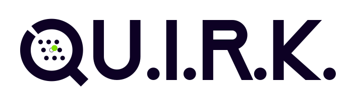
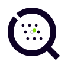
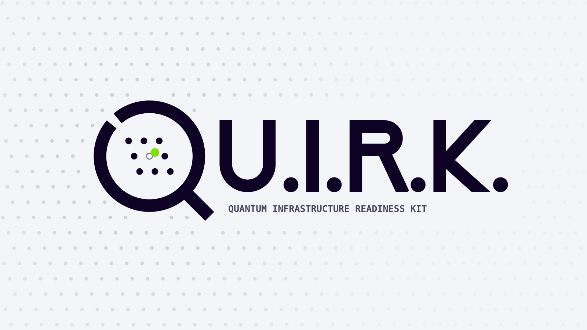

# QU.I.R.K. brand

A scanner lens over a lattice, and the lens is always the Q. The geometry carries six post-quantum easter eggs.

- **[BRAND-GUIDELINES.md](BRAND-GUIDELINES.md)**: the rules (logo system, construction, colour, type, co-branding, don'ts).
- **[brand-sheet.html](brand-sheet.html)**: interactive construction guide.
- **[build_logo.py](build_logo.py)**: generates every SVG here. Don't hand-edit the SVGs; change this and run `python3 docs/brand/build_logo.py`.

The generator takes an optional output directory: `python3 docs/brand/build_logo.py [OUT_DIR]`.

**Public URL contract.** The repo `README.md` (and therefore every published PyPI page) loads
`quirk-logo.svg` and `quirk-logo-dark.svg` from `raw.githubusercontent.com` on `main`. Renaming or
deleting any file in `docs/brand/` breaks published pages, so treat these filenames as a public URL
contract. `tests/test_readme_brand_logo.py` pins the exact URLs.

**Rasters.** PNGs are produced by `python -m scripts.build_brand_rasters` (resvg-py, dev-only).

**Freshness gate.** `tests/test_brand_assets_freshness.py` fails if any SVG, packaged copy
(`quirk/reports/assets/`, `src/dashboard/src/assets/brand/`) or PNG drifts from its generator.
Regenerate with `python3 docs/brand/build_logo.py` and `python -m scripts.build_brand_rasters`,
then recommit.

| Logo | Mark | Hero |
|---|---|---|
|  |  |  |
